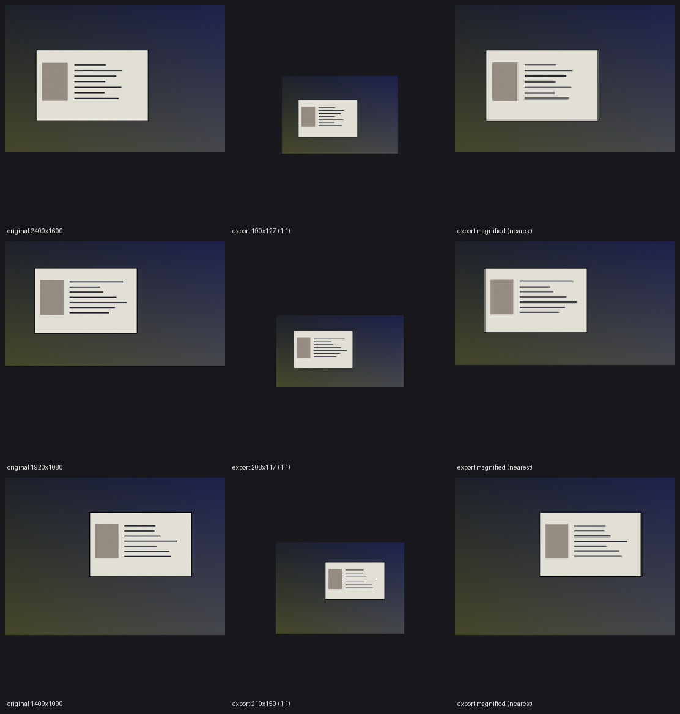

# Anonymised training data for document liveness — evidence for review

*Prepared 2026-09-29 for DPO / legal review. Research project, no model deployed. All numbers trace to files under `runs/train_reports/` and to commits on `main`.*

## 1. What is being asked

Approval to export **production document-capture frames at a resolution where identity content is illegible**, for use as training data in the document presentation-attack (screen-replay) detector, under the pipeline described here. The request has two parts: (a) classification of the exported representation, and (b) approval of the export procedure, including custody of the re-identification map.

## 2. The data and what is sensitive in it

Each record is a photograph or video frame of an identity document, sometimes with surroundings (desk, screen bezel, hand). Sensitive content is the **document interior**: portrait, name, date of birth, document number, address, MRZ, signature. For the collection datasets used so far, nothing outside the document identifies a person (confirmed by the data owner). For production frames this is an assumption to be verified as part of the export review, not an established fact.

## 3. Method

The exported representation is the **whole frame, downscaled so the document's long side is 96 px** (`export_lowres_frames.py --mode doc --size 96`). At that scale a typical ID card is 96 × 60 px; the frame is 160–220 px wide.

Procedure (`export_lowres_frames.py`, commit `662a5ad`):

1. One box-filter resample (area average) to the target scale; no other processing. Output is PNG.
2. Each frame gets an opaque 128-bit identifier; the output order is shuffled so neither file order nor CSV order groups frames by source.
3. Two CSVs are written. `anon_<split>.csv` (`path, label, bbox`) is the artefact that leaves the trusted zone. `manifest.csv` maps identifier → source path, scale and size; **it is the re-identification map and stays inside the trusted zone.**
4. `summary.json` records class balance, skipped rows per label (any skip that hits one class more than the other is flagged — a model would otherwise learn the skip), and the legibility proxy below.

Document-relative rather than frame-relative scaling turns the legibility bound from a population statistic into a **per-image guarantee**: a close-up capture is scaled harder than a distant one.

*Synthetic fixture only — no real documents appear in this document. The "text" here is thick synthetic bars and stays visible where real 2.5 px glyphs would not; the real-data measurements are in §5.*

## 4. Evidence that the representation is useful

The model is judged on **production validation data** (`ProdTest-0.3`: 3,739 frames, 2,876 bona fide / 863 screen replays, labels from two independent reviewers) and on an in-distribution test set (Pinterest, 4,784 frames). Equal-error rate (EER), lower is better. Three epochs unless stated; two seeds where stated. Files: `runs/train_reports/`.

| training input | test EER | **production EER** |
|---|---|---|
| full frame, unmodified (baseline) | 3.24 | **14.95** |
| full frame downscaled to 192 px long side (`downscale:192`) | 3.01 | **15.88** |
| full frame, document long side → 96 px (`downscale_doc:96`) | 8.09 | **16.20** |
| baseline, 10 epochs, seeds 42 / 7 | 6.23 / 3.01 | 13.67 / 12.17 |
| `downscale:192`, 10 epochs, seeds 42 / 7 | 3.24 / 7.40 | 14.25 / 14.38 |

Seed-to-seed spread with identical configuration is 3–4 points on the test set and about 2 on production, so single-run differences smaller than that are noise. On production, the low-resolution representation costs **0–3 points** relative to the unmodified frames. Every other anonymisation candidate cost more:

| alternative | production EER |
|---|---|
| document interior masked (5 % border kept) | 19.69 |
| document interior masked entirely | 22.95 |
| document only, no surroundings | 24.81 |
| document interior pixelated to 64 px | 19.58 |
| frame downscaled to 128 px | 19.36 |
| **native-resolution 512 px patches** | **37.95** (chance; AUC 0.56) |

The patch result is the most informative: patches carry fine texture (moiré, halftone) and reach 1.67 % EER per document on the in-distribution test set — better than the baseline — yet fall to chance on production. **Fine texture is specific to the collection setups (ten phones and monitors); the signal that transfers to production is coarse** and survives the downscale intact. Removing the fine detail costs nothing that generalises.

Context for the decision: the current model's production EER is ~15 %, and at a 0.5 threshold it misses ~64 % of production replays. Production data in training is the remedy; the export is what makes that possible.

## 5. Evidence that identity content is illegible

Geometric proxy computed per image from the document box (`legibility_proxy.py`, and `summary.json` of each export): field text height ≈ 4 % of the document's short side; face height ≈ 35 %. Thresholds are conservative: text ≥ 5 px counted as potentially OCR-readable, face ≥ 40 px as potentially matchable, face < 24 px as negligible.

| split | frames | text px p50 / p90 | text < 5 px | face px p50 / p90 | face < 40 px |
|---|---|---|---|---|---|
| train (36,216) | 18,108 / 18,108 | 2.6 / 3.1 | 100 % both classes | 22.4 / 27.1 | 100 % |
| production validation (3,739) | 2,876 / 863 | 2.5 / 2.7 | 100 % | 21.5 / 24.1 | 100 % |
| test (4,784) | 433 / 4,351 | 2.5 / 2.9 | 100 % | 21.6 / 25.6 | 100 % |

For comparison, at the model's native input resolution (512 px frame) the same proxy leaves text legible in ~85 % of frames and faces matchable in ~90 %; at a 192 px frame, 8–11 % of frames still exceed the text threshold. The document-relative export removes those tails.

**Caveats.** (a) This is a geometric proxy, not an OCR or face-recognition audit; an empirical audit — OCR and a face matcher run against the exported frames and 2× upsampled copies — is planned once those detectors are available internally, and should be a condition of any release beyond the research team. (b) Passport data pages have relatively smaller print than ID-1 cards, so the proxy is conservative for them; hand-written signatures are not modelled by the proxy and are illegible at this scale by the same geometry.

## 6. What survives, and the residual risks

At 96 px the frame still conveys: document type and layout, dominant colours, the presence and shape of a screen bezel or glare, the room or desk, framing. None of this identifies a person from the pixels. Residual risks and mitigations:

| risk | mitigation |
|---|---|
| Linkage via the manifest | Manifest never leaves the trusted zone; export job deletes it where it runs inside a job (`sagemaker_job/train_anon.py` pattern). Custody and retention to be set by DPO. |
| Rare identifying scene content (a person in the background) | Not present in the collection datasets; for production exports it must be checked, since the downscale reduces but does not eliminate it. A face detector run over the full-resolution frames before export is the intended control once available. |
| Re-inflation by super-resolution | Bounded: at 2.5 px per text line there are ~2 samples per glyph; no reconstruction recovers characters. To be confirmed by the empirical audit in §5(a). |
| Label-correlated processing | Export applies identically to both classes and all splits; skips per label are reported and the job refuses a one-class output. |
| Document type / country distribution | Disclosed as an aggregate property of the dataset; not personal data. |

## 7. Recommendation and asks

1. **Classify** the 96 px document-relative export. Our reading is that it is anonymised in the Recital 26 sense — identification is not reasonably likely without the manifest — but this is the DPO's call; the alternative reading (pseudonymised, with the manifest as the key) still permits use under a documented legal basis and retention policy.
2. **Approve the export procedure** for production frames, with the manifest retained only inside the trusted zone and a retention period set for both artefacts.
3. **Condition**: the empirical OCR / face-match audit in §5(a) before any use beyond the research team, with acceptance criteria of zero recovered identity strings and zero face matches on the exported frames.

## 8. Reproducibility

Repository `main` (GitHub `aleksanderkhaimin-seon/liveness`): training-time transforms `--degrade` in `train_efficientnet_b2.py` (commit `5cbbb2c`, `7e0bb85`); export `export_lowres_frames.py` (`7e0bb85`, `662a5ad`); legibility proxy `legibility_proxy.py` (`880fb3f`); patch experiment `sample_document_patches.py`, `aggregate_patch_eer.py` (`9211171`, `224e2a5`). Run reports: `runs/train_reports/report-*.json`, `runs/train_reports/Sept-28/`, export summaries `runs/train_reports/Sept-28/summary-{train,val,test}.json`.
